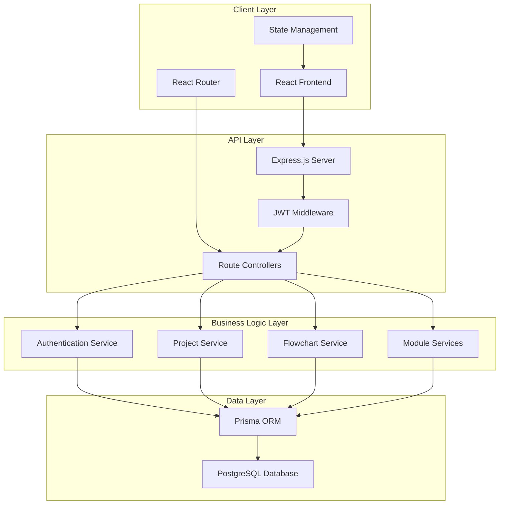

# Design Document

## Overview

The NPD (New Product Development Pumps Havells) application is designed as a modern, enterprise-grade web application using a full-stack JavaScript architecture. The system follows a modular, microservice-inspired frontend architecture with a RESTful backend API, ensuring scalability and maintainability for future enhancements.

### Technology Stack

**Frontend:**
- React.js 18+ with TypeScript for type safety and better developer experience
- Tailwind CSS for utility-first styling and consistent design system
- React Flow for interactive flowchart functionality with advanced node types
- React Router for client-side routing
- Axios for API communication
- React Hook Form for comprehensive form management
- Framer Motion for smooth animations and transitions
- React Query for server state management and caching
- Date-fns for date manipulation and formatting
- Lucide React for modern icons

**Backend:**
- Node.js with Express.js framework
- TypeScript for backend type safety
- JWT for authentication and session management
- bcrypt for password hashing
- express-validator for input validation
- CORS middleware for cross-origin requests
- multer for file upload handling (future documents feature)

**Database:**
- PostgreSQL for relational data storage
- Prisma ORM for database operations and migrations
- Connection pooling for performance optimization
- JSONB for flexible flowchart data storage

**Development Tools:**
- Vite for fast development and building
- ESLint and Prettier for code quality
- Jest and React Testing Library for testing
- Playwright for E2E testing

## Architecture

### System Architecture



### Frontend Architecture

The frontend follows a feature-based modular architecture:

```
src/
├── components/           # Reusable UI components
│   ├── common/          # Generic components (Button, Card, Modal)
│   ├── layout/          # Layout components (Header, Sidebar, Footer)
│   └── flowchart/       # Flowchart-specific components
├── features/            # Feature-based modules
│   ├── auth/           # Authentication module
│   ├── dashboard/      # Main dashboard
│   ├── npd/           # NPD module
│   ├── vave/          # VA/VE module
│   └── standardization/ # Standardization module
├── hooks/              # Custom React hooks
├── services/           # API service layer
├── types/              # TypeScript type definitions
├── utils/              # Utility functions
└── styles/             # Global styles and Tailwind config
```

### Backend Architecture

The backend follows a layered architecture pattern:

```
src/
├── controllers/        # Route handlers
├── services/          # Business logic layer
├── models/            # Database models (Prisma)
├── middleware/        # Express middleware
├── routes/            # API route definitions
├── utils/             # Utility functions
├── config/            # Configuration files
└── types/             # TypeScript interfaces
```

## Components and Interfaces

### Core Components

#### Authentication Components
- **LoginForm**: Handles user authentication with email/password
- **AuthGuard**: Protects routes requiring authentication
- **SessionManager**: Manages JWT tokens and session state

#### Dashboard Components
- **DashboardLayout**: Main layout with navigation
- **ModuleCard**: Reusable card component for NPD, VA/VE, Standardization
- **QuickStats**: Dashboard statistics and metrics

#### Project Management Components
- **ProjectGrid**: Grid layout for project cards with search and sorting
- **ProjectCard**: Enhanced project display with metadata (ID, status, owner, progress)
- **ProjectForm**: Comprehensive create/edit form with all required fields
- **ProjectSearch**: Advanced search and filter functionality
- **ProjectSorting**: Sort by name, creation date, and status
- **StatusBadge**: Visual status indicators with color coding

#### NPD Workspace Components
- **ProjectWorkspace**: Main workspace layout with three-panel design
- **WorkspaceSidebar**: Left sidebar with tabbed navigation
- **WorkspaceMainArea**: Center flowchart area
- **WorkspaceInfoPanel**: Right information panel
- **SidebarTabs**: Overview, Flowchart, Documents, Team, Tasks, Timeline, Reports
- **ProgressTracker**: Visual progress percentage display

#### Enhanced Flowchart Components
- **FlowchartWorkspace**: Advanced flowchart container with React Flow
- **CustomNodeTypes**: Start, Process, Decision, Review, Approval, Milestone, End nodes
- **NodeEditor**: Comprehensive node property editor
- **FlowchartToolbar**: Enhanced toolbar with save, zoom, template controls
- **ConnectionHandler**: Advanced node connection management
- **WorkflowTemplate**: NPD workflow template system
- **AutoSaveManager**: Automatic flowchart saving functionality

### API Interfaces

#### Authentication Endpoints
```typescript
POST /api/auth/login
POST /api/auth/logout
POST /api/auth/refresh
GET /api/auth/profile
```

#### Enhanced Project Management Endpoints
```typescript
GET /api/projects/:moduleType                    # Get all projects with search/filter
POST /api/projects/:moduleType                   # Create new project
GET /api/projects/:moduleType/:id                # Get specific project
PUT /api/projects/:moduleType/:id                # Update project
DELETE /api/projects/:moduleType/:id             # Delete project
GET /api/projects/:moduleType/:id/progress       # Get project progress
PUT /api/projects/:moduleType/:id/status         # Update project status

# Enhanced search and filtering
GET /api/projects/:moduleType?search=query&status=active&sortBy=name&sortOrder=asc
```

#### Workflow Template Endpoints
```typescript
GET /api/templates/npd                           # Get NPD workflow template
POST /api/projects/:id/apply-template            # Apply template to project
GET /api/projects/:id/workflow                   # Get project workflow
PUT /api/projects/:id/workflow                   # Save workflow changes
```

#### Team and Task Management Endpoints
```typescript
GET /api/projects/:id/team                       # Get project team members
POST /api/projects/:id/team                      # Add team member
DELETE /api/projects/:id/team/:userId            # Remove team member
GET /api/projects/:id/tasks                      # Get project tasks
POST /api/projects/:id/tasks                     # Create task
PUT /api/projects/:id/tasks/:taskId              # Update task
```

#### Flowchart Endpoints
```typescript
GET /api/flowcharts/:projectId
PUT /api/flowcharts/:projectId
POST /api/flowcharts/:projectId/validate
```

### Component Interfaces

```typescript
// Enhanced Project interface with Phase 2 requirements
interface Project {
  id: string;
  name: string;
  projectCode: string;                    // New: Project Code
  productCategory: string;                // New: Product Category
  projectOwner: string;                   // New: Project Owner
  startDate: Date;                        // New: Start Date
  targetCompletionDate: Date;             // New: Target Completion Date
  description: string;                    // New: Project Description
  progressPercentage: number;             // New: Progress Percentage
  moduleType: 'npd' | 'vave' | 'standardization';
  status: 'not_started' | 'in_progress' | 'under_review' | 'approved' | 'delayed' | 'completed';
  createdBy: string;
  createdAt: Date;
  updatedAt: Date;
  lastModifiedDate: Date;                 // New: Last Modified Date
  flowchartData?: FlowchartData;
  teamMembers?: TeamMember[];             // New: Team Members
  tasks?: Task[];                         // New: Tasks
  documents?: Document[];                 // New: Documents
}

// NPD Workflow Template
interface NPDWorkflowTemplate {
  id: string;
  name: string;
  nodes: TemplateNode[];
  edges: TemplateEdge[];
  description: string;
}

interface TemplateNode {
  id: string;
  type: 'start' | 'process' | 'decision' | 'review' | 'approval' | 'milestone' | 'end';
  position: { x: number; y: number };
  data: {
    label: string;
    description?: string;
    estimatedDuration?: number;
    requiredApprovals?: string[];
  };
}

// Enhanced FlowchartData with new node types
interface FlowchartData {
  nodes: FlowNode[];
  edges: FlowEdge[];
  viewport: Viewport;
  templateId?: string;
  version: number;
  autoSaveEnabled: boolean;
}

interface FlowNode {
  id: string;
  type: 'start' | 'process' | 'decision' | 'review' | 'approval' | 'milestone' | 'end';
  position: { x: number; y: number };
  data: {
    label: string;
    status?: 'pending' | 'in_progress' | 'approved' | 'rejected' | 'completed';
    comments?: string;
    color?: string;
    assignedTo?: string;
    dueDate?: Date;
    completionDate?: Date;
    approvers?: string[];
  };
}

// Team Management
interface TeamMember {
  id: string;
  userId: string;
  projectId: string;
  role: 'owner' | 'manager' | 'engineer' | 'reviewer' | 'approver';
  permissions: string[];
  joinedAt: Date;
  user: {
    id: string;
    name: string;
    email: string;
    department: string;
  };
}

// Task Management
interface Task {
  id: string;
  projectId: string;
  title: string;
  description?: string;
  status: 'todo' | 'in_progress' | 'review' | 'completed';
  priority: 'low' | 'medium' | 'high' | 'critical';
  assignedTo?: string;
  dueDate?: Date;
  completedAt?: Date;
  createdAt: Date;
  updatedAt: Date;
  dependencies?: string[];
  estimatedHours?: number;
  actualHours?: number;
}

// Document Management
interface Document {
  id: string;
  projectId: string;
  name: string;
  type: 'specification' | 'drawing' | 'report' | 'approval' | 'other';
  fileUrl: string;
  fileSize: number;
  mimeType: string;
  uploadedBy: string;
  uploadedAt: Date;
  version: number;
  tags?: string[];
}

// Project Search and Filter
interface ProjectSearchParams {
  query?: string;
  status?: ProjectStatus[];
  owner?: string;
  category?: string;
  dateRange?: {
    start: Date;
    end: Date;
  };
  sortBy: 'name' | 'createdAt' | 'updatedAt' | 'status' | 'progress';
  sortOrder: 'asc' | 'desc';
  page: number;
  limit: number;
}

// Workspace Layout
interface WorkspaceLayout {
  sidebarWidth: number;
  infoPanelWidth: number;
  activeTab: 'overview' | 'flowchart' | 'documents' | 'team' | 'tasks' | 'timeline' | 'reports';
  flowchartZoom: number;
  flowchartPosition: { x: number; y: number };
}
```

## Data Models

### Enhanced Database Schema for Phase 2

```sql
-- Users table with enhanced fields
CREATE TABLE users (
  id UUID PRIMARY KEY DEFAULT gen_random_uuid(),
  email VARCHAR(255) UNIQUE NOT NULL,
  username VARCHAR(100) UNIQUE NOT NULL,
  password_hash VARCHAR(255) NOT NULL,
  first_name VARCHAR(100),
  last_name VARCHAR(100),
  department VARCHAR(100),
  role VARCHAR(50) DEFAULT 'user',
  created_at TIMESTAMP DEFAULT CURRENT_TIMESTAMP,
  updated_at TIMESTAMP DEFAULT CURRENT_TIMESTAMP
);

-- Enhanced Projects table with Phase 2 fields
CREATE TABLE projects (
  id UUID PRIMARY KEY DEFAULT gen_random_uuid(),
  name VARCHAR(255) NOT NULL,
  project_code VARCHAR(100) UNIQUE NOT NULL,
  product_category VARCHAR(100) NOT NULL,
  project_owner VARCHAR(255) NOT NULL,
  start_date DATE NOT NULL,
  target_completion_date DATE NOT NULL,
  description TEXT,
  progress_percentage INTEGER DEFAULT 0 CHECK (progress_percentage >= 0 AND progress_percentage <= 100),
  module_type VARCHAR(50) NOT NULL CHECK (module_type IN ('npd', 'vave', 'standardization')),
  status VARCHAR(50) DEFAULT 'not_started' CHECK (status IN ('not_started', 'in_progress', 'under_review', 'approved', 'delayed', 'completed')),
  created_by UUID REFERENCES users(id),
  created_at TIMESTAMP DEFAULT CURRENT_TIMESTAMP,
  updated_at TIMESTAMP DEFAULT CURRENT_TIMESTAMP,
  last_modified_date TIMESTAMP DEFAULT CURRENT_TIMESTAMP
);

-- Flowcharts table with enhanced features
CREATE TABLE flowcharts (
  id UUID PRIMARY KEY DEFAULT gen_random_uuid(),
  project_id UUID REFERENCES projects(id) ON DELETE CASCADE,
  flowchart_data JSONB NOT NULL,
  template_id VARCHAR(100),
  version INTEGER DEFAULT 1,
  auto_save_enabled BOOLEAN DEFAULT true,
  created_at TIMESTAMP DEFAULT CURRENT_TIMESTAMP,
  updated_at TIMESTAMP DEFAULT CURRENT_TIMESTAMP
);

-- NPD Workflow Templates
CREATE TABLE workflow_templates (
  id UUID PRIMARY KEY DEFAULT gen_random_uuid(),
  name VARCHAR(255) NOT NULL,
  module_type VARCHAR(50) NOT NULL,
  template_data JSONB NOT NULL,
  description TEXT,
  is_default BOOLEAN DEFAULT false,
  created_at TIMESTAMP DEFAULT CURRENT_TIMESTAMP,
  updated_at TIMESTAMP DEFAULT CURRENT_TIMESTAMP
);

-- Team Members
CREATE TABLE project_team_members (
  id UUID PRIMARY KEY DEFAULT gen_random_uuid(),
  project_id UUID REFERENCES projects(id) ON DELETE CASCADE,
  user_id UUID REFERENCES users(id) ON DELETE CASCADE,
  role VARCHAR(50) NOT NULL CHECK (role IN ('owner', 'manager', 'engineer', 'reviewer', 'approver')),
  permissions JSONB DEFAULT '[]',
  joined_at TIMESTAMP DEFAULT CURRENT_TIMESTAMP,
  UNIQUE(project_id, user_id)
);

-- Tasks
CREATE TABLE tasks (
  id UUID PRIMARY KEY DEFAULT gen_random_uuid(),
  project_id UUID REFERENCES projects(id) ON DELETE CASCADE,
  title VARCHAR(255) NOT NULL,
  description TEXT,
  status VARCHAR(50) DEFAULT 'todo' CHECK (status IN ('todo', 'in_progress', 'review', 'completed')),
  priority VARCHAR(50) DEFAULT 'medium' CHECK (priority IN ('low', 'medium', 'high', 'critical')),
  assigned_to UUID REFERENCES users(id),
  due_date DATE,
  completed_at TIMESTAMP,
  estimated_hours INTEGER,
  actual_hours INTEGER,
  dependencies JSONB DEFAULT '[]',
  created_at TIMESTAMP DEFAULT CURRENT_TIMESTAMP,
  updated_at TIMESTAMP DEFAULT CURRENT_TIMESTAMP
);

-- Documents
CREATE TABLE documents (
  id UUID PRIMARY KEY DEFAULT gen_random_uuid(),
  project_id UUID REFERENCES projects(id) ON DELETE CASCADE,
  name VARCHAR(255) NOT NULL,
  type VARCHAR(50) DEFAULT 'other' CHECK (type IN ('specification', 'drawing', 'report', 'approval', 'other')),
  file_url VARCHAR(500) NOT NULL,
  file_size BIGINT NOT NULL,
  mime_type VARCHAR(100) NOT NULL,
  uploaded_by UUID REFERENCES users(id),
  uploaded_at TIMESTAMP DEFAULT CURRENT_TIMESTAMP,
  version INTEGER DEFAULT 1,
  tags JSONB DEFAULT '[]'
);

-- Enhanced workflow validation data
CREATE TABLE workflow_validations (
  id UUID PRIMARY KEY DEFAULT gen_random_uuid(),
  project_id UUID REFERENCES projects(id) ON DELETE CASCADE,
  node_id VARCHAR(255) NOT NULL,
  validation_criteria JSONB,
  status VARCHAR(50) CHECK (status IN ('pending', 'in_progress', 'approved', 'rejected', 'completed')),
  assigned_to UUID REFERENCES users(id),
  due_date DATE,
  completion_date DATE,
  comments TEXT,
  created_at TIMESTAMP DEFAULT CURRENT_TIMESTAMP,
  updated_at TIMESTAMP DEFAULT CURRENT_TIMESTAMP
);

-- Performance indexes
CREATE INDEX idx_projects_module_type ON projects(module_type);
CREATE INDEX idx_projects_created_by ON projects(created_by);
CREATE INDEX idx_projects_status ON projects(status);
CREATE INDEX idx_projects_project_code ON projects(project_code);
CREATE INDEX idx_projects_product_category ON projects(product_category);
CREATE INDEX idx_projects_project_owner ON projects(project_owner);
CREATE INDEX idx_flowcharts_project_id ON flowcharts(project_id);
CREATE INDEX idx_team_members_project_id ON project_team_members(project_id);
CREATE INDEX idx_team_members_user_id ON project_team_members(user_id);
CREATE INDEX idx_tasks_project_id ON tasks(project_id);
CREATE INDEX idx_tasks_assigned_to ON tasks(assigned_to);
CREATE INDEX idx_documents_project_id ON documents(project_id);
CREATE INDEX idx_workflow_validations_project_id ON workflow_validations(project_id);
```

### Enhanced Prisma Schema for Phase 2

```prisma
generator client {
  provider = "prisma-client-js"
}

datasource db {
  provider = "postgresql"
  url      = env("DATABASE_URL")
}

model User {
  id          String    @id @default(cuid())
  email       String    @unique
  username    String    @unique
  passwordHash String   @map("password_hash")
  firstName   String?   @map("first_name")
  lastName    String?   @map("last_name")
  department  String?
  role        String    @default("user")
  createdAt   DateTime  @default(now()) @map("created_at")
  updatedAt   DateTime  @updatedAt @map("updated_at")
  
  // Relations
  projects           Project[]
  teamMemberships    ProjectTeamMember[]
  assignedTasks      Task[]              @relation("TaskAssignee")
  uploadedDocuments  Document[]
  workflowValidations WorkflowValidation[]
  
  @@map("users")
}

model Project {
  id                    String        @id @default(cuid())
  name                  String
  projectCode           String        @unique @map("project_code")
  productCategory       String        @map("product_category")
  projectOwner          String        @map("project_owner")
  startDate             DateTime      @map("start_date") @db.Date
  targetCompletionDate  DateTime      @map("target_completion_date") @db.Date
  description           String?       @db.Text
  progressPercentage    Int           @default(0) @map("progress_percentage")
  moduleType            ModuleType    @map("module_type")
  status                ProjectStatus @default(NOT_STARTED)
  createdBy             String        @map("created_by")
  createdAt             DateTime      @default(now()) @map("created_at")
  updatedAt             DateTime      @updatedAt @map("updated_at")
  lastModifiedDate      DateTime      @default(now()) @map("last_modified_date")
  
  // Relations
  user                User                @relation(fields: [createdBy], references: [id])
  flowchart           Flowchart?
  teamMembers         ProjectTeamMember[]
  tasks               Task[]
  documents           Document[]
  workflowValidations WorkflowValidation[]
  
  @@map("projects")
}

model WorkflowTemplate {
  id           String     @id @default(cuid())
  name         String
  moduleType   ModuleType @map("module_type")
  templateData Json       @map("template_data")
  description  String?    @db.Text
  isDefault    Boolean    @default(false) @map("is_default")
  createdAt    DateTime   @default(now()) @map("created_at")
  updatedAt    DateTime   @updatedAt @map("updated_at")
  
  @@map("workflow_templates")
}

model Flowchart {
  id              String   @id @default(cuid())
  projectId       String   @unique @map("project_id")
  flowchartData   Json     @map("flowchart_data")
  templateId      String?  @map("template_id")
  version         Int      @default(1)
  autoSaveEnabled Boolean  @default(true) @map("auto_save_enabled")
  createdAt       DateTime @default(now()) @map("created_at")
  updatedAt       DateTime @updatedAt @map("updated_at")
  
  // Relations
  project Project @relation(fields: [projectId], references: [id], onDelete: Cascade)
  
  @@map("flowcharts")
}

model ProjectTeamMember {
  id          String   @id @default(cuid())
  projectId   String   @map("project_id")
  userId      String   @map("user_id")
  role        TeamRole
  permissions Json     @default("[]")
  joinedAt    DateTime @default(now()) @map("joined_at")
  
  // Relations
  project Project @relation(fields: [projectId], references: [id], onDelete: Cascade)
  user    User    @relation(fields: [userId], references: [id], onDelete: Cascade)
  
  @@unique([projectId, userId])
  @@map("project_team_members")
}

model Task {
  id              String      @id @default(cuid())
  projectId       String      @map("project_id")
  title           String
  description     String?     @db.Text
  status          TaskStatus  @default(TODO)
  priority        TaskPriority @default(MEDIUM)
  assignedTo      String?     @map("assigned_to")
  dueDate         DateTime?   @map("due_date") @db.Date
  completedAt     DateTime?   @map("completed_at")
  estimatedHours  Int?        @map("estimated_hours")
  actualHours     Int?        @map("actual_hours")
  dependencies    Json        @default("[]")
  createdAt       DateTime    @default(now()) @map("created_at")
  updatedAt       DateTime    @updatedAt @map("updated_at")
  
  // Relations
  project  Project @relation(fields: [projectId], references: [id], onDelete: Cascade)
  assignee User?   @relation("TaskAssignee", fields: [assignedTo], references: [id])
  
  @@map("tasks")
}

model Document {
  id         String       @id @default(cuid())
  projectId  String       @map("project_id")
  name       String
  type       DocumentType @default(OTHER)
  fileUrl    String       @map("file_url")
  fileSize   BigInt       @map("file_size")
  mimeType   String       @map("mime_type")
  uploadedBy String       @map("uploaded_by")
  uploadedAt DateTime     @default(now()) @map("uploaded_at")
  version    Int          @default(1)
  tags       Json         @default("[]")
  
  // Relations
  project  Project @relation(fields: [projectId], references: [id], onDelete: Cascade)
  uploader User    @relation(fields: [uploadedBy], references: [id])
  
  @@map("documents")
}

model WorkflowValidation {
  id                 String                    @id @default(cuid())
  projectId          String                    @map("project_id")
  nodeId             String                    @map("node_id")
  validationCriteria Json?                     @map("validation_criteria")
  status             WorkflowValidationStatus  @default(PENDING)
  assignedTo         String?                   @map("assigned_to")
  dueDate            DateTime?                 @map("due_date") @db.Date
  completionDate     DateTime?                 @map("completion_date") @db.Date
  comments           String?                   @db.Text
  createdAt          DateTime                  @default(now()) @map("created_at")
  updatedAt          DateTime                  @updatedAt @map("updated_at")
  
  // Relations
  project  Project @relation(fields: [projectId], references: [id], onDelete: Cascade)
  assignee User?   @relation(fields: [assignedTo], references: [id])
  
  @@map("workflow_validations")
}

// Enums
enum ModuleType {
  NPD             @map("npd")
  VAVE            @map("vave")
  STANDARDIZATION @map("standardization")
}

enum ProjectStatus {
  NOT_STARTED   @map("not_started")
  IN_PROGRESS   @map("in_progress")
  UNDER_REVIEW  @map("under_review")
  APPROVED      @map("approved")
  DELAYED       @map("delayed")
  COMPLETED     @map("completed")
}

enum TeamRole {
  OWNER     @map("owner")
  MANAGER   @map("manager")
  ENGINEER  @map("engineer")
  REVIEWER  @map("reviewer")
  APPROVER  @map("approver")
}

enum TaskStatus {
  TODO        @map("todo")
  IN_PROGRESS @map("in_progress")
  REVIEW      @map("review")
  COMPLETED   @map("completed")
}

enum TaskPriority {
  LOW      @map("low")
  MEDIUM   @map("medium")
  HIGH     @map("high")
  CRITICAL @map("critical")
}

enum DocumentType {
  SPECIFICATION @map("specification")
  DRAWING       @map("drawing")
  REPORT        @map("report")
  APPROVAL      @map("approval")
  OTHER         @map("other")
}

enum WorkflowValidationStatus {
  PENDING     @map("pending")
  IN_PROGRESS @map("in_progress")
  APPROVED    @map("approved")
  REJECTED    @map("rejected")
  COMPLETED   @map("completed")
}
```

## Error Handling

### Frontend Error Handling
- **Global Error Boundary**: Catches and displays React component errors
- **API Error Interceptor**: Handles HTTP errors and token expiration
- **Form Validation**: Real-time validation with user-friendly messages
- **Network Error Handling**: Offline detection and retry mechanisms

### Backend Error Handling
- **Global Error Middleware**: Centralized error processing
- **Validation Errors**: Input validation with detailed error messages
- **Database Errors**: Connection and query error handling
- **Authentication Errors**: JWT validation and session management errors

```typescript
// Error response interface
interface ApiError {
  success: false;
  error: {
    code: string;
    message: string;
    details?: any;
  };
  timestamp: string;
}

// Success response interface
interface ApiSuccess<T> {
  success: true;
  data: T;
  timestamp: string;
}
```

## Testing Strategy

### Frontend Testing
- **Unit Tests**: Component testing with React Testing Library
- **Integration Tests**: Feature workflow testing
- **E2E Tests**: Critical user journey testing with Playwright
- **Visual Regression Tests**: UI consistency testing

### Backend Testing
- **Unit Tests**: Service and utility function testing with Jest
- **Integration Tests**: API endpoint testing with supertest
- **Database Tests**: Repository layer testing with test database
- **Security Tests**: Authentication and authorization testing

### Test Coverage Goals
- Minimum 80% code coverage for critical paths
- 100% coverage for authentication and security functions
- Integration tests for all API endpoints
- E2E tests for core user workflows

### Testing Environment Setup
```typescript
// Jest configuration for frontend
export default {
  testEnvironment: 'jsdom',
  setupFilesAfterEnv: ['<rootDir>/src/test/setup.ts'],
  moduleNameMapping: {
    '^@/(.*)$': '<rootDir>/src/$1',
  },
  collectCoverageFrom: [
    'src/**/*.{ts,tsx}',
    '!src/**/*.d.ts',
    '!src/test/**',
  ],
};

// Test database setup
const testConfig = {
  database: {
    url: process.env.TEST_DATABASE_URL,
    schema: 'test_schema',
  },
};
```

## Security Considerations

### Authentication Security
- JWT tokens with short expiration times (15 minutes access, 7 days refresh)
- Secure HTTP-only cookies for refresh tokens
- Password hashing with bcrypt (12 rounds minimum)
- Rate limiting on authentication endpoints

### Data Security
- Input validation and sanitization on all endpoints
- SQL injection prevention through Prisma ORM
- XSS protection with Content Security Policy
- CORS configuration for allowed origins only

### Session Management
- Automatic token refresh mechanism
- Secure logout with token blacklisting
- Session timeout handling
- Multi-device session management

## Performance Optimization

### Frontend Optimization
- Code splitting by routes and features
- Lazy loading of heavy components (flowchart editor)
- Memoization of expensive calculations
- Virtual scrolling for large project lists
- Image optimization and lazy loading

### Backend Optimization
- Database connection pooling
- Query optimization with proper indexing
- Caching strategy for frequently accessed data
- Compression middleware for API responses
- Rate limiting to prevent abuse

### Database Optimization
```sql
-- Performance indexes
CREATE INDEX idx_projects_module_type ON projects(module_type);
CREATE INDEX idx_projects_created_by ON projects(created_by);
CREATE INDEX idx_projects_status ON projects(status);
CREATE INDEX idx_flowcharts_project_id ON flowcharts(project_id);
```

## Deployment Architecture

### Development Environment
- Local development with Docker Compose
- Hot reloading for both frontend and backend
- Test database with sample data
- Environment variable management

### Production Environment
- Containerized deployment with Docker
- Load balancing with nginx
- SSL/TLS termination
- Database backup and recovery procedures
- Monitoring and logging setup

### CI/CD Pipeline
- Automated testing on pull requests
- Code quality checks with ESLint and Prettier
- Security scanning with npm audit
- Automated deployment to staging and production
- Database migration management