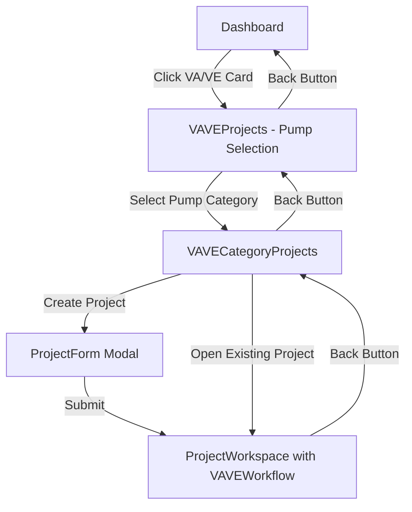
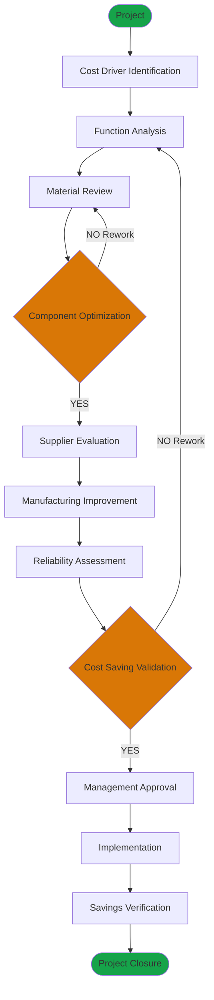

# Design Document: VA/VE Pump Type Selection

## Overview

This feature implements the pump type selection workflow for the VA/VE (Value Analysis / Value Engineering) module by replicating the proven NPD module pattern. The implementation transforms the current VA/VE projects page from a traditional project list view into a two-tier navigation system: a pump category selection landing page followed by category-specific project lists.

### Design Goals

1. **Consistency**: Match the NPD module's user experience exactly to maintain familiarity
2. **Reusability**: Leverage existing components and services to minimize code duplication
3. **Modularity**: Implement VA/VE-specific flowchart without affecting NPD or Standardization modules
4. **Maintainability**: Use the same architectural patterns across all modules

### Key Changes

- **VAVEProjects.tsx**: Transform from project list to pump selection landing page
- **New Component**: VAVECategoryProjects.tsx for category-specific project management
- **New Component**: VAVEWorkflow.tsx for Value Engineering flowchart
- **Routing**: Add `/vave/:categoryId` route for category-specific views
- **Workspace**: Extend ProjectWorkspace to render VA/VE flowchart based on module type

## Architecture

### Component Hierarchy

```
Dashboard
  └─> VAVEProjects (Pump Selection Landing)
       └─> VAVECategoryProjects (Category-Specific Projects)
            └─> ProjectWorkspace
                 └─> VAVEWorkflow (Value Engineering Flowchart)
```

### Navigation Flow



### Module Comparison

| Aspect | NPD Module | VA/VE Module (New) |
|--------|-----------|-------------------|
| Landing Page | NPDProjects (pump selection) | VAVEProjects (pump selection) |
| Category View | NPDCategoryProjects | VAVECategoryProjects |
| Workspace | ProjectWorkspace + NPDWorkflow | ProjectWorkspace + VAVEWorkflow |
| Routes | `/npd`, `/npd/:categoryId` | `/vave`, `/vave/:categoryId` |
| Flowchart Stages | 16 NPD stages | 12 VA/VE stages |

## Components and Interfaces

### 1. VAVEProjects Component (Refactored)

**Purpose**: Pump category selection landing page

**Current State**: Traditional project list with search/filter
**New State**: Pump category grid (matching NPDProjects.tsx)

**Key Changes**:
```typescript
// Remove: Project list, search, filters, create button
// Add: Pump category grid with project counts

interface VAVEProjectsProps {}

interface CategoryCardData {
  category: PumpCategory;
  projectCount: number;
}
```

**Layout Structure**:
- Header: Back button, module badge, title
- Main: Title section + responsive grid of pump category cards
- Each card: Image, category name, project count badge
- On click: Navigate to `/vave/:categoryId`

**Reused Components**:
- `Button` from `@/components/common`
- `getPumpCategoriesForModule('vave')` from `@/data/pumpCategories`
- `projectService.getProjectsByModule('vave')` for counts

### 2. VAVECategoryProjects Component (New)

**Purpose**: Category-specific project list and management

**File**: `src/features/vave/pages/VAVECategoryProjects.tsx`

**Pattern**: Clone of NPDCategoryProjects.tsx with VA/VE branding

```typescript
interface VAVECategoryProjectsProps {}

interface ProjectFormData {
  name: string;
  owner: string;
  startDate: string;
  description?: string;
}
```

**Features**:
- Display pump category info banner with image
- Project search and status filtering
- Create new project (with category pre-selected)
- Edit/delete existing projects
- Navigate to project workspace

**Reused Components**:
- `ProjectCard` - displays individual projects
- `ProjectForm` - create/edit modal
- `ProjectSearch` - search and filter UI
- `Button`, `Card` - common UI components
- `getPumpCategoryById()` - category data lookup
- `projectService` - all CRUD operations

### 3. VAVEWorkflow Component (New)

**Purpose**: Value Engineering flowchart visualization

**File**: `src/features/vave/components/VAVEWorkflow.tsx`

**Pattern**: Clone of NPDWorkflow.tsx with VA/VE stages

```typescript
interface VAVEWorkflowProps {
  projectId: string;
}

interface WorkflowNodeData {
  label: string;
  nodeStatus: NodeStatus;
  fileCount: number;
  passedCriteria: number;
  totalCriteria: number;
  lastModified?: Date;
  variant?: 'start' | 'end';
  accentColor?: string;
}
```

**Architecture**:
- ReactFlow-based visualization
- Same node types: `workflowProcess`, `workflowDecision`, `workflowOval`
- Same interaction patterns: click to open stage panel, file upload, review workflow
- Different stage topology (12 stages vs 16)

**Reused Components**:
- `WorkflowProcessNode`, `WorkflowDecisionNode`, `WorkflowOvalNode` from NPD
- `StagePanel` - stage details and file management
- `DocumentsPanel` - all documents view
- `WorkflowMetrics` - progress indicators
- `workflowService` - state management

### 4. ProjectWorkspace Component (Modified)

**Purpose**: Render appropriate flowchart based on module type

**Current State**: Always renders NPDWorkflow
**New State**: Conditionally render NPDWorkflow or VAVEWorkflow

```typescript
// Add conditional rendering
{moduleType === 'npd' && <NPDWorkflow projectId={project.id} />}
{moduleType === 'vave' && <VAVEWorkflow projectId={project.id} />}
{moduleType === 'standardization' && <StandardizationWorkflow projectId={project.id} />}
```

**Changes Required**:
- Import VAVEWorkflow component
- Add conditional rendering logic based on `moduleType` param
- No changes to layout, header, or info cards

## Data Models

### Pump Category Data

**Source**: `src/data/pumpCategories.ts`

```typescript
type PumpCategoryId = 
  | 'centrifugal-pump'
  | 'single-stage-pressure-pump'
  | 'multi-stage-booster-pump'
  | 'open-well-submersible-pump'
  | 'borewell-3-4-inch'
  | 'shallow-well-jet-pump'
  | 'deep-well-jet-pump'
  | 'sewage-submersible-pump'
  | 'inline-circulating-pump'
  | 'dewatering-submersible-pump';

interface PumpCategory {
  id: PumpCategoryId;
  name: string;
  shortName: string;
  description: string;
  image: string;
  isStandards: ISStandard[];
  documentTemplates: DocumentTemplate[];
  validationRules: ValidationRule[];
  applicableModules: ModuleType[]; // includes 'vave'
}
```

**Usage**:
- `getPumpCategoriesForModule('vave')` - get all VA/VE-applicable categories
- `getPumpCategoryById(categoryId)` - get specific category details

### Project Data

**Source**: `src/types/index.ts`

```typescript
interface Project {
  id: string;
  name: string;
  owner: string;
  startDate: string;
  description?: string;
  moduleType: 'npd' | 'vave' | 'standardization';
  pumpCategory?: PumpCategoryId; // NEW: stores selected pump type
  status: ProjectStatus;
  createdAt: Date;
  updatedAt: Date;
  createdBy: string;
}
```

**Key Addition**: `pumpCategory` field stores the selected pump type for filtering and display

### Workflow State

**Source**: `src/services/workflowService.ts`

```typescript
interface WorkflowState {
  projectId: string;
  stages: Record<string, StageData>;
  lastSaved: Date;
}

interface StageData {
  id: string;
  status: NodeStatus;
  files: FileData[];
  validationCriteria: ValidationCriterion[];
  lastModifiedAt?: Date;
}

type NodeStatus = 'idle' | 'reviewing' | 'approved' | 'needs-correction' | 'rejected';
```

**Reuse**: Same data structure for VA/VE workflow, different stage IDs

## VA/VE Flowchart Configuration

### Stage Definitions

The VA/VE flowchart contains 12 stages representing the Value Engineering workflow:

```typescript
const VAVE_STAGES = {
  'project': 'Project',
  'cost-driver': 'Cost Driver Identification',
  'function-analysis': 'Function Analysis',
  'material-review': 'Material Review',
  'component-optimization': 'Component Optimization',
  'supplier-evaluation': 'Supplier Evaluation',
  'manufacturing-improvement': 'Manufacturing Improvement',
  'reliability-assessment': 'Reliability Assessment',
  'cost-saving-validation': 'Cost Saving Validation',
  'management-approval': 'Management Approval',
  'implementation': 'Implementation',
  'savings-verification': 'Savings Verification',
  'project-closure': 'Project Closure',
};
```

### Node Types and Layout

```typescript
const TYPE_MAP: Record<string, 'workflowProcess' | 'workflowDecision' | 'workflowOval'> = {
  'project': 'workflowOval',                    // Start node
  'cost-driver': 'workflowProcess',
  'function-analysis': 'workflowProcess',
  'material-review': 'workflowProcess',
  'component-optimization': 'workflowDecision', // Decision point
  'supplier-evaluation': 'workflowProcess',
  'manufacturing-improvement': 'workflowProcess',
  'reliability-assessment': 'workflowProcess',
  'cost-saving-validation': 'workflowDecision', // Decision point
  'management-approval': 'workflowProcess',
  'implementation': 'workflowProcess',
  'savings-verification': 'workflowProcess',
  'project-closure': 'workflowOval',            // End node
};
```

### Node Positions

Horizontal flow with decision branches:

```typescript
const POSITIONS: Record<string, { x: number; y: number }> = {
  'project':                    { x:  530, y:    0 },
  'cost-driver':                { x:  530, y:  130 },
  'function-analysis':          { x:  530, y:  260 },
  'material-review':            { x:  530, y:  390 },
  'component-optimization':     { x:  530, y:  520 }, // Decision
  
  // Approved path (left branch)
  'supplier-evaluation':        { x:  310, y:  520 },
  'manufacturing-improvement':  { x:   90, y:  520 },
  'reliability-assessment':     { x: -130, y:  520 },
  'cost-saving-validation':     { x: -350, y:  520 }, // Decision
  
  // Approved path continues
  'management-approval':        { x: -350, y:  390 },
  'implementation':             { x: -350, y:  260 },
  'savings-verification':       { x: -350, y:  130 },
  'project-closure':            { x: -350, y:    0 },
};
```

### Edge Connections

```typescript
const VAVE_EDGES = [
  // Main flow
  { id: 'e1',  source: 'project', target: 'cost-driver' },
  { id: 'e2',  source: 'cost-driver', target: 'function-analysis' },
  { id: 'e3',  source: 'function-analysis', target: 'material-review' },
  { id: 'e4',  source: 'material-review', target: 'component-optimization' },
  
  // Component optimization decision
  { id: 'e5',  source: 'component-optimization', target: 'supplier-evaluation', label: 'YES' },
  { id: 'e6',  source: 'component-optimization', target: 'material-review', label: 'NO (Rework)' },
  
  // Optimization path
  { id: 'e7',  source: 'supplier-evaluation', target: 'manufacturing-improvement' },
  { id: 'e8',  source: 'manufacturing-improvement', target: 'reliability-assessment' },
  { id: 'e9',  source: 'reliability-assessment', target: 'cost-saving-validation' },
  
  // Cost saving validation decision
  { id: 'e10', source: 'cost-saving-validation', target: 'management-approval', label: 'YES' },
  { id: 'e11', source: 'cost-saving-validation', target: 'function-analysis', label: 'NO (Rework)' },
  
  // Approval to closure
  { id: 'e12', source: 'management-approval', target: 'implementation' },
  { id: 'e13', source: 'implementation', target: 'savings-verification' },
  { id: 'e14', source: 'savings-verification', target: 'project-closure' },
];
```

### Node Accent Colors

```typescript
const NODE_ACCENT: Record<string, string> = {
  'project':                    '#16a34a', // Green (start)
  'cost-driver':                '#ea580c', // Orange
  'function-analysis':          '#2563eb', // Blue
  'material-review':            '#7c3aed', // Purple
  'component-optimization':     '#d97706', // Amber (decision)
  'supplier-evaluation':        '#0891b2', // Cyan
  'manufacturing-improvement':  '#2563eb', // Blue
  'reliability-assessment':     '#7c3aed', // Purple
  'cost-saving-validation':     '#d97706', // Amber (decision)
  'management-approval':        '#ea580c', // Orange
  'implementation':             '#16a34a', // Green
  'savings-verification':       '#0891b2', // Cyan
  'project-closure':            '#16a34a', // Green (end)
};
```

### Flowchart Diagram



## Data Flow

### 1. Pump Category Selection Flow

```
User clicks VA/VE card on Dashboard
  ↓
Navigate to /vave (VAVEProjects)
  ↓
Load pump categories: getPumpCategoriesForModule('vave')
  ↓
Load project counts: projectService.getProjectsByModule('vave')
  ↓
Display category grid with counts
  ↓
User clicks category card
  ↓
Navigate to /vave/:categoryId (VAVECategoryProjects)
```

### 2. Project Creation Flow

```
User on VAVECategoryProjects page
  ↓
Click "Create Project" button
  ↓
Open ProjectForm modal with category pre-selected
  ↓
User fills: name, owner, startDate, description
  ↓
Submit form
  ↓
projectService.createProject({
  ...formData,
  moduleType: 'vave',
  pumpCategory: categoryId
}, userId)
  ↓
Project created with pump category stored
  ↓
Navigate to /workspace/vave/:projectId
  ↓
ProjectWorkspace renders VAVEWorkflow
```

### 3. Workspace Rendering Flow

```
ProjectWorkspace loads
  ↓
Extract moduleType from URL params
  ↓
Load project: projectService.getProjectById(projectId)
  ↓
Conditional render based on moduleType:
  - 'npd' → <NPDWorkflow projectId={projectId} />
  - 'vave' → <VAVEWorkflow projectId={projectId} />
  - 'standardization' → <StandardizationWorkflow projectId={projectId} />
  ↓
Workflow component loads state: workflowService.getWorkflowState(projectId)
  ↓
Render flowchart with stage-specific data
```

### 4. Stage Interaction Flow

```
User clicks node in VAVEWorkflow
  ↓
Open StagePanel with stage data
  ↓
User uploads files / marks criteria
  ↓
workflowService.updateStageData(projectId, stageId, data)
  ↓
Update localStorage
  ↓
Refresh workflow state
  ↓
Node visual updates (status color, file count, criteria progress)
```

## Reuse Strategy

### Components to Reuse (No Changes)

1. **Common UI Components**
   - `Button` - all button interactions
   - `Card` - container styling
   - `Modal` - form dialogs
   - `Input` - form fields
   - `HavellsLogo` - branding

2. **Project Components**
   - `ProjectCard` - project display cards
   - `ProjectForm` - create/edit modal
   - `ProjectSearch` - search and filter UI

3. **Workflow Components**
   - `WorkflowProcessNode` - rectangular process nodes
   - `WorkflowDecisionNode` - diamond decision nodes
   - `WorkflowOvalNode` - oval start/end nodes
   - `StagePanel` - stage details sidebar
   - `DocumentsPanel` - all documents view
   - `WorkflowMetrics` - progress indicators

4. **Services**
   - `projectService` - all CRUD operations
   - `workflowService` - workflow state management
   - `authService` - authentication

5. **Data**
   - `pumpCategories.ts` - category definitions
   - `authorizedUsers.ts` - user data

### Components to Create (New)

1. **VAVECategoryProjects.tsx**
   - Clone NPDCategoryProjects.tsx
   - Change module references from 'npd' to 'vave'
   - Update navigation paths
   - Update branding (colors, labels)

2. **VAVEWorkflow.tsx**
   - Clone NPDWorkflow.tsx
   - Replace stage definitions with VA/VE stages
   - Update node positions for VA/VE topology
   - Update edge connections
   - Keep all interaction logic identical

### Components to Modify (Minimal Changes)

1. **VAVEProjects.tsx**
   - Remove: Project list, search, filters
   - Add: Pump category grid (copy from NPDProjects.tsx)
   - Keep: Header, navigation, module branding

2. **ProjectWorkspace.tsx**
   - Add: Import VAVEWorkflow
   - Add: Conditional rendering based on moduleType
   - Keep: All layout, header, info cards unchanged

3. **App.tsx**
   - Add: Route for `/vave/:categoryId`
   - Keep: All existing routes unchanged

### Code Reuse Metrics

| Category | Reused | New | Modified | Total |
|----------|--------|-----|----------|-------|
| Components | 15 | 2 | 3 | 20 |
| Services | 3 | 0 | 0 | 3 |
| Data Files | 2 | 0 | 0 | 2 |
| **Total** | **20** | **2** | **3** | **25** |

**Reuse Percentage**: 80% (20/25)

## Error Handling

### Category Not Found

```typescript
// In VAVECategoryProjects.tsx
if (!category) {
  return (
    <Card className="p-8 text-center">
      <AlertCircle className="h-10 w-10 text-red-400 mx-auto mb-3" />
      <h2>Unknown pump category</h2>
      <Button onClick={() => navigate('/vave')}>
        Back to VA/VE
      </Button>
    </Card>
  );
}
```

### Project Load Failure

```typescript
// In ProjectWorkspace.tsx
if (error) {
  return (
    <Card className="p-8 text-center">
      <AlertCircle className="h-10 w-10 text-red-400 mx-auto mb-3" />
      <h2>Project Not Found</h2>
      <p>{error}</p>
      <Button onClick={() => navigate(`/${moduleType}`)}>
        Back
      </Button>
    </Card>
  );
}
```

### Project Creation Failure

```typescript
// In VAVECategoryProjects.tsx
const handleCreateProject = async (data: ProjectFormData) => {
  try {
    setFormLoading(true);
    const response = await projectService.createProject({...}, userId);
    if (!response.success) {
      throw new Error(response.error?.message || 'Failed to create project');
    }
    // Success handling
  } catch (err) {
    // Error is thrown back to ProjectForm for display
    throw err;
  } finally {
    setFormLoading(false);
  }
};
```

### Workflow State Load Failure

```typescript
// In workflowService.ts
getWorkflowState(projectId: string): WorkflowState {
  try {
    const stored = localStorage.getItem(`workflow_${projectId}`);
    if (stored) {
      return JSON.parse(stored);
    }
  } catch (error) {
    console.error('Failed to load workflow state:', error);
  }
  // Return default state if load fails
  return this.initializeWorkflowState(projectId);
}
```

## Testing Strategy

### Unit Tests

1. **Component Rendering**
   - VAVEProjects renders pump category grid
   - VAVECategoryProjects renders project list
   - VAVEWorkflow renders correct number of nodes
   - ProjectWorkspace conditionally renders correct workflow

2. **Navigation**
   - Clicking category card navigates to correct route
   - Back buttons navigate to correct parent pages
   - Project card click navigates to workspace

3. **Data Loading**
   - Pump categories load correctly for VA/VE module
   - Project counts calculate correctly
   - Category-filtered projects load correctly

4. **Form Submission**
   - Project creation includes pump category
   - Form validation works correctly
   - Error handling displays messages

5. **Workflow Interactions**
   - Node click opens stage panel
   - File upload updates node state
   - Review workflow updates node status
   - Criteria marking updates progress

### Integration Tests

1. **End-to-End Flow**
   - Dashboard → VAVEProjects → VAVECategoryProjects → ProjectWorkspace
   - Create project with pump category → Open workspace → See VA/VE flowchart
   - Upload files to stage → Verify persistence → Reload → Files still present

2. **Module Isolation**
   - VA/VE changes don't affect NPD projects
   - NPD changes don't affect VA/VE projects
   - Shared components work in both modules

3. **Data Persistence**
   - Project data persists across page reloads
   - Workflow state persists across page reloads
   - Pump category association persists

### Manual Testing Checklist

- [ ] Dashboard VA/VE card navigates to pump selection
- [ ] All 10 pump categories display with correct images
- [ ] Project counts display correctly on category cards
- [ ] Category card hover effects work
- [ ] Clicking category navigates to category projects page
- [ ] Category info banner displays correctly
- [ ] Create project button opens form with category pre-selected
- [ ] Project creation succeeds and navigates to workspace
- [ ] Workspace displays VA/VE flowchart (not NPD)
- [ ] All 12 VA/VE stages display correctly
- [ ] Stage nodes have correct colors and labels
- [ ] Clicking stage opens stage panel
- [ ] File upload works in stage panel
- [ ] Review workflow (reviewing → approved/rejected) works
- [ ] Criteria marking updates node progress
- [ ] Documents panel shows all files across stages
- [ ] Back navigation works at all levels
- [ ] NPD module still works correctly (no regression)
- [ ] Responsive design works on mobile/tablet

## Implementation Notes

### File Structure

```
src/
├── features/
│   ├── vave/
│   │   ├── pages/
│   │   │   ├── VAVEProjects.tsx (modified)
│   │   │   └── VAVECategoryProjects.tsx (new)
│   │   └── components/
│   │       └── VAVEWorkflow.tsx (new)
│   ├── npd/
│   │   ├── pages/
│   │   │   ├── NPDProjects.tsx (reference)
│   │   │   └── NPDCategoryProjects.tsx (reference)
│   │   └── components/
│   │       └── NPDWorkflow.tsx (reference)
│   └── common/
│       └── pages/
│           └── ProjectWorkspace.tsx (modified)
├── App.tsx (modified - add route)
└── data/
    └── pumpCategories.ts (unchanged)
```

### Implementation Order

1. **Phase 1: Routing Setup**
   - Add `/vave/:categoryId` route in App.tsx
   - Test route navigation

2. **Phase 2: VAVEProjects Refactor**
   - Copy pump selection grid from NPDProjects.tsx
   - Update module references to 'vave'
   - Test category display and navigation

3. **Phase 3: VAVECategoryProjects Creation**
   - Clone NPDCategoryProjects.tsx
   - Update all module references
   - Update navigation paths
   - Test project CRUD operations

4. **Phase 4: VAVEWorkflow Creation**
   - Clone NPDWorkflow.tsx
   - Replace stage definitions
   - Update node positions and edges
   - Test flowchart rendering

5. **Phase 5: ProjectWorkspace Integration**
   - Add VAVEWorkflow import
   - Add conditional rendering logic
   - Test workspace with both NPD and VA/VE projects

6. **Phase 6: Testing & Polish**
   - Run full test suite
   - Manual testing of all flows
   - Fix any bugs or styling issues
   - Verify NPD module still works

### Migration Considerations

**Existing VA/VE Projects**: Projects created before this feature will not have a `pumpCategory` field. Handle gracefully:

```typescript
// In VAVEProjects.tsx - count projects without category
const uncategorizedCount = projects.filter(p => !p.pumpCategory).length;

// Display "Uncategorized" option if needed
if (uncategorizedCount > 0) {
  // Show special card for uncategorized projects
}
```

**Backward Compatibility**: The old VAVEProjects list view is replaced. If needed, provide a "View All Projects" link that shows all VA/VE projects regardless of category.

### Performance Considerations

1. **Project Count Calculation**: Load all VA/VE projects once and calculate counts in memory rather than multiple API calls
2. **Image Loading**: Use lazy loading for pump category images
3. **Workflow State**: Load workflow state only when workspace is opened, not on project list pages
4. **Memoization**: Use React.memo for category cards to prevent unnecessary re-renders

### Accessibility

1. **Keyboard Navigation**: All category cards and buttons are keyboard accessible
2. **Screen Readers**: Add aria-labels to category cards describing pump type and project count
3. **Focus Management**: Manage focus when opening/closing modals and panels
4. **Color Contrast**: Ensure all text meets WCAG AA standards (already handled by existing design system)

### Browser Compatibility

- Modern browsers (Chrome, Firefox, Safari, Edge) - last 2 versions
- ReactFlow requires modern browser features (no IE11 support)
- LocalStorage for workflow state (fallback to in-memory if unavailable)

## Future Enhancements

1. **Category Filtering**: Add ability to filter projects by multiple categories
2. **Category Analytics**: Show metrics per pump category (avg completion time, success rate)
3. **Category Templates**: Pre-populate validation criteria based on pump category
4. **Bulk Operations**: Move projects between categories, bulk status updates
5. **Category Customization**: Allow admins to add/remove pump categories
6. **Export/Import**: Export VA/VE projects with category metadata
7. **Category-Specific Workflows**: Different VA/VE stages based on pump complexity
8. **Integration**: Connect to external systems for pump specifications and standards
